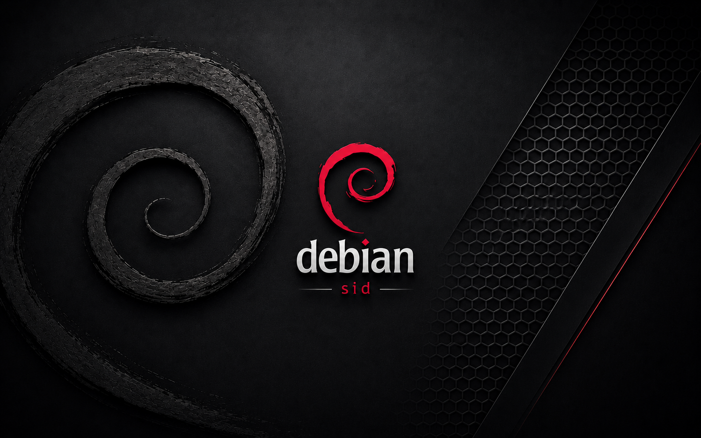
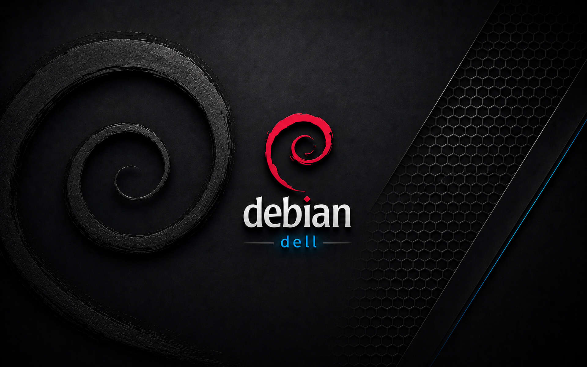
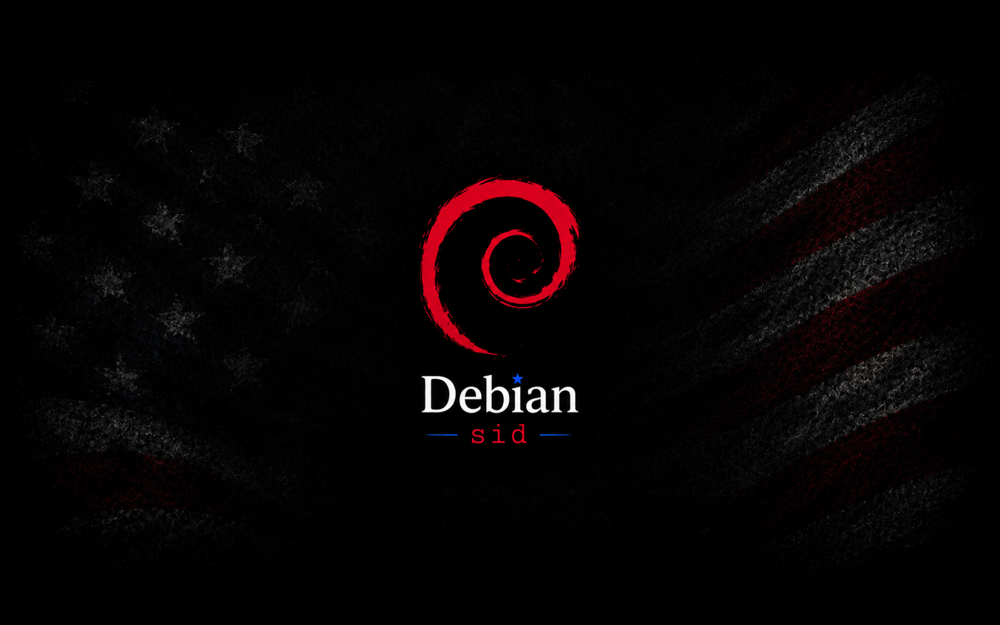

# Debian Sid Artwork

A collection of custom artwork created for my personal Debian systems.

This repository contains two related desktop themes featuring matching wallpapers, GRUB backgrounds, Plymouth splash screens, and KDE Plasma launcher icons. The artwork was originally created for my own daily-driver systems and is shared here for anyone who enjoys the same aesthetic.

---

## Themes

### 🔴 Debian Sid Edition

A dark Debian Sid theme featuring:

- Classic red Debian swirl
- Red **SID** branding and accent colors
- Matching wallpaper
- Matching GRUB background
- Matching Plymouth splash screen



---

### 🔵 Debian Dell Edition

A variation of the same design created for my Dell laptop running Debian.

This edition preserves the same Debian identity while replacing the red **SID** branding with blue **Dell** branding and matching blue accent colors.

It includes:

- Classic red Debian swirl
- Blue **Dell** branding and accent colors
- Matching wallpaper
- Matching GRUB background
- Matching Plymouth splash screen



---

### 🏴 Debian Sid Flag Artwork

A Debian Sid flag theme featuring matching wallpaper, GRUB background, and Plymouth splash screen artwork.



---

## KDE Plasma Launcher Icons

Two matching KDE Plasma application launcher icons are included and may be used with either theme:

- Round
- Rounded Square

---

## Repository Layout

```
debian-sid-artwork/
├── README.md
├── LICENSE
│
├── debian-sid/
│   ├── debian-sid-wallpaper.png
│   ├── debian-sid-grub.png
│   └── debian-sid-plymouth.png
│
├── debian-dell/
│   ├── debian-dell-wallpaper.png
│   ├── debian-dell-grub.png
│   └── debian-dell-plymouth.png
│
└── kde-launcher/
    ├── launcher-round.png
    └── launcher-rounded-square.png
```

---

## Why?

I run Debian Sid as my daily driver and wanted a desktop that reflected the system I enjoy using every day.

These themes grew from that idea and continue to evolve alongside my Debian systems.

---

## Related Projects

The same Debian Sid environment that inspired this artwork also inspired several of my open-source projects:

- BootPrep
- cleanup-bootstrap-root
- add_subvolumes
- add_updategrub-service
- dpkg-pre-post-snapper

---

## License

Licensed under the Creative Commons Attribution-ShareAlike 4.0 International (CC BY-SA 4.0) License.
